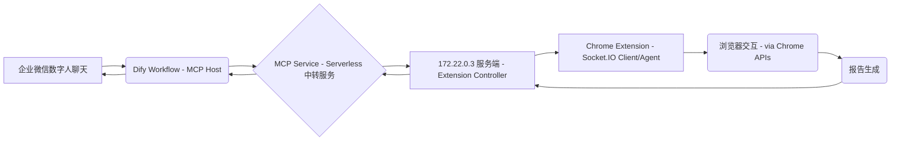
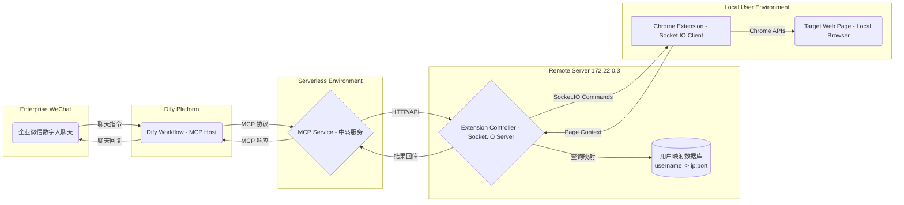

# Midscene MCP 架构重构与 Python 服务实现规划

本文档旨在为将现有 Midscene Chrome 扩展及相关能力，重构为基于模型上下文协议 (MCP) 的远程浏览器控制系统提供一份详细的规划与调试指南。该系统将包括一个新的、轻量化的 Chrome 扩展（负责执行具体浏览器操作）和一个新的 Python 服务（作为MCP服务端，并远程控制Chrome扩展）。

## 0. 产品链路预期概览

项目最终将融入以下产品链路：



### 用户交互模式

1. **扩展安装与登录**：用户安装 Chrome 扩展后，首次打开需要进行登录认证
2. **用户注册与端口分配**：登录成功后，扩展将用户名（企业微信英文名）和用户 IP 上报给 172.22.0.3 服务端，服务端为该用户生成唯一端口号
3. **建立连接**：扩展使用分配的端口与服务端建立 Socket.IO 连接，服务端维护用户名、IP 和端口的映射关系
4. **远程控制**：用户在企业微信中与数字人聊天时，MCP 服务通过映射关系找到对应用户的浏览器进行操作

### 关键架构变更总结

与原有架构相比，新架构的主要变更包括：

1. **服务分离**: 将原来的单一 Python Service 分离为 Serverless 部署的 MCP Service 和固定服务器上的 Extension Controller
2. **用户认证**: 增加基于企业微信英文名的用户认证机制
3. **动态端口分配**: 为每个用户分配独立的 Socket.IO 端口，实现用户隔离
4. **用户映射管理**: 维护用户名、IP 地址和端口的映射关系，支持精确的用户定位
5. **企业级部署**: 支持企业微信集成和 Serverless 部署模式

## 1. 项目概述与目标

### 1.1. 最终系统架构



### 1.2. 组件职责

*   **Chrome 扩展 (浏览器操作代理)**:
    *   在本地用户的浏览器上运行。
    *   **登录认证**: 首次使用时需要用户登录，获取企业微信英文名作为唯一标识。
    *   **用户注册**: 登录成功后，将用户名和本机 IP 地址上报给 172.22.0.3 服务端。
    *   **端口获取**: 从服务端获取分配的唯一端口号，并本地存储。
    *   **Socket.IO 连接**: 使用分配的端口与 172.22.0.3 服务端建立 Socket.IO 连接。
    *   **指令执行**: 监听来自服务端的操作指令，转化为具体的浏览器操作。
    *   **上下文回传**: 采集页面信息并回传给服务端。
    *   **它本身不实现 MCP 协议。**

*   **MCP Service (Serverless 中转服务)**:
    *   部署在 Serverless 环境中。
    *   **MCP 服务端**: 使用官方的 `modelcontextprotocol/python-sdk` 实现，向 Dify 暴露浏览器自动化工具。
    *   **请求转发**: 接收来自 Dify 的 MCP 工具调用，转发给 172.22.0.3 服务端。
    *   **用户识别**: 从 MCP 请求中提取用户标识信息，传递给服务端进行用户映射。
    *   **响应中转**: 将服务端的执行结果按 MCP 协议格式返回给 Dify。

*   **Extension Controller (172.22.0.3 服务端)**:
    *   部署在固定服务器 172.22.0.3 上。
    *   **用户映射管理**: 维护用户名、IP 地址和端口号的映射关系数据库。
    *   **端口分配**: 为新用户动态分配唯一端口号。
    *   **Socket.IO 服务端**: 在多个端口上运行 Socket.IO 服务，每个用户使用独立端口。
    *   **指令路由**: 根据用户标识找到对应的 Socket.IO 连接，发送操作指令。
    *   **AI 能力**: 集成 LLM/VLM 进行任务规划和元素定位。
    *   **结果聚合**: 收集扩展执行结果，处理后返回给 MCP Service。

*   **Dify Workflow (MCP Host)**:
    *   企业微信数字人聊天的后端处理平台。
    *   通过 MCP 协议调用 Serverless 中转服务的浏览器自动化工具。

## 2. 第一部分：Chrome 扩展改造 (作为浏览器操作代理)

目标：将现有 `@apps/chrome-extension` 改造为一个轻量级的、支持用户认证和端口分配的浏览器操作代理。

### 2.0. 用户认证与连接建立流程

#### 2.0.1. 首次使用流程
1. **用户安装扩展**：用户从 Chrome 应用商店安装扩展
2. **首次打开登录**：扩展检测到未登录状态，显示登录界面
3. **企业微信认证**：用户输入企业微信英文名进行身份认证
4. **用户注册**：登录成功后，扩展自动获取本机 IP 地址，连同用户名一起上报给 172.22.0.3 服务端
5. **端口分配**：服务端为该用户分配唯一端口号，并返回给扩展
6. **本地存储**：扩展将用户名、分配的端口号等信息存储到 `chrome.storage.local`
7. **建立连接**：扩展使用分配的端口与服务端建立 Socket.IO 连接

#### 2.0.2. 后续使用流程
1. **自动连接**：扩展启动时检查本地存储的认证信息
2. **端口验证**：使用存储的端口号尝试连接服务端
3. **连接恢复**：如果连接失败，重新进行用户注册流程

#### 2.0.3. 服务端映射管理
服务端需要维护以下映射关系：
```json
{
  "username": "zhangsan",
  "ip_address": "192.168.1.100", 
  "port": 8001,
  "last_active": "2024-01-01T10:00:00Z",
  "connection_status": "connected"
}
```

### 2.1. 核心通信机制的转变与保留

*   **保留并强化 Socket.IO/WebSocket 客户端逻辑**: Chrome 扩展中现有的用于"Bridge 模式"的 Socket.IO 客户端 (或类似的自定义 WebSocket 客户端) 逻辑是新架构的核心。这部分代码需要被保留、适配和强化，使其能够稳定地连接到 Python Service 提供的 WebSocket/Socket.IO 服务端，并高效处理指令的收发。
*   **移除对 `@midscene/mcp` 特定桥接协议的依赖**: 如果当前扩展的桥接模式与 `@midscene/mcp` 包之间存在一些特殊的、非通用的协议细节，这些需要被通用化，以适应新的 Python 后端。
*   **无需实现 MCP 客户端**: 扩展不需要引入或实现任何 MCP 客户端的协议栈。

### 2.2. 精简现有扩展功能

*   **梳理功能**:
    *   **核心保留与适配**:
        *   **Service Worker (`worker.ts`)**:
            *   作为扩展的生命周期管理者和后台任务处理中心。
            *   最核心的职责是承载 **WebSocket/Socket.IO 客户端逻辑**，负责与 Python Service 建立和维持双向通信。
            *   处理消息的序列化、反序列化。
            *   管理连接状态，实现断线重连机制。
            *   作为指令分发中心，接收到 Python Service 的指令后，调用相应的 Chrome API 或内容脚本执行。
        *   **内容脚本 (`midscene_element_inspector.js` 或其演进版本)**:
            *   在目标页面上下文中运行，用于执行那些需要直接访问 DOM 或页面 JavaScript 环境的操作。
            *   例如，精确的元素查找、获取元素属性、执行页面内定义的 JavaScript 函数。
            *   需要提供清晰的接口供 Service Worker 通过 `chrome.scripting.executeScript` 调用。
        *   **页面交互核心逻辑 (`chrome.debugger` API 和 `chrome.scripting` API)**:
            *   `chrome.debugger` API: 用于更底层的浏览器控制，如模拟用户输入事件 (鼠标点击、键盘输入)、精确控制滚动、截屏、获取网络请求等。Service Worker 将根据指令调用这些API。
            *   `chrome.scripting.executeScript`: 用于在目标页面注入和执行内容脚本，或动态执行代码片段。
        *   **适配 `ExtensionBridgePageBrowserSide` 逻辑 (`apps/chrome-extension/src/extension/bridge.tsx`)**:
            *   此类中原有的通过 Socket.IO (或等效 WebSocket) 与后端通信的逻辑是宝贵的经验。
            *   **具体适配步骤**:
                1.  **分析现有通信协议**: 仔细研究 `ExtensionBridgePageBrowserSide` 与其后端通信时所使用的消息格式、事件名、数据结构。
                2.  **提取核心处理函数**: 将处理接收到的指令、执行相应浏览器操作、以及发送结果回后端的函数逻辑提取出来。
                3.  **迁移到 Service Worker**: 将这些核心处理函数迁移到 Service Worker (`worker.ts`) 中。由于 Service Worker 没有直接的 DOM 访问权限，原来直接操作 `window` 或 `document` 的部分需要改为通过 `chrome.scripting.executeScript` 或 `chrome.debugger` API 来实现。
                4.  **调整事件监听**: Socket.IO 的事件监听 (`socket.on('eventName', ...)` ) 需要在 Service Worker 中重新建立，并确保与 Python Service 定义的 WebSocket/Socket.IO 事件名一致。
                5.  **状态管理**: 如果原有逻辑依赖 React 组件状态，需要将这部分状态剥离，或在 Service Worker 中用更简单的方式管理（例如，使用 `chrome.storage.local` 或内存变量，并注意 Service Worker 的生命周期）。
            *   目标是复用其命令接收、解析、分发执行、结果上报的流程和经验，而不是直接复用 React 组件代码。
    *   **剥离/简化**:
        *   **Popup UI (`popup.tsx`, `playground.tsx`)**:
            *   **功能重新设计**: 主要包含用户认证和连接管理功能。
            *   **核心功能**:
                *   **登录界面**: 首次使用时显示企业微信英文名输入框和登录按钮。
                *   **用户信息显示**: 显示当前登录用户名和分配的端口号。
                *   **连接状态**: 显示与 172.22.0.3 服务端的连接状态（连接中、已连接、已断开）。
                *   **手动操作**: 提供重新登录、手动连接/断开的按钮。
                *   **状态日志**: 显示简要的连接日志和错误信息。
                *   **设置选项**: 可选的服务端地址配置（默认为 172.22.0.3）。
            *   **UI 状态管理**:
                *   未登录状态：显示登录表单
                *   已登录未连接：显示用户信息和连接按钮
                *   已连接状态：显示连接状态和操作日志
            *   **建议**: 保持使用 React 以便于状态管理，但移除 Playground 相关的复杂组件。
        *   **与本地 Playground 和旧 Bridge UI 强相关的状态管理 (`store.tsx`)**:
            *   如果 Popup UI 大幅简化，相应的 Zustand (或其他状态管理库) 中的 store 也可以大幅简化或移除。
            *   Service Worker 自身的状态管理（如连接状态、配置信息）可以通过 `chrome.storage.local` 或其内部变量管理。
*   **构建配置调整**:
    *   **`rsbuild.config.ts` (或 Webpack/Vite 配置)**:
        *   移除或调整 Popup 页面的入口点（如果 Popup UI 改变或移除）。
        *   确保 Service Worker (`worker.ts`) 和必要的内容脚本 (`midscene_element_inspector.js`) 被正确打包。
        *   优化打包输出，移除未使用的代码和依赖。
    *   **`static/manifest.json`**:
        *   **权限（`permissions`）**: 确保只声明必要的权限，如 `debugger`, `scripting`, `storage`, `activeTab` (如果需要在当前激活标签页操作)。移除不再需要的权限。
        *   **后台脚本 (`background`)**: 明确指定 Service Worker (`"service_worker": "worker.js"`)。
        *   **内容脚本 (`content_scripts`)**: 配置好内容脚本的匹配规则 (`matches`) 和注入时机 (`run_at`)。
        *   **Action (`action`)**: 如果 Popup UI 保留，配置 `action.default_popup`; 如果移除，可以考虑只用 `action.default_icon` 显示状态，或不定义 `action`。
        *   移除与旧 UI 或 Playground 相关的配置。
    *   **`package.json`**:
        *   移除不再需要的依赖库，特别是与复杂 UI (如 React, Ant Design, Zustand 中与 UI 相关的部分) 和本地开发服务器相关的。

### 2.3. WebSocket/Socket.IO 通信接口定义 (扩展侧)

*   **连接管理 (Service Worker)**:
    *   实现连接到远程 Python Service 的 WebSocket/Socket.IO 服务端 (地址可配置，例如通过 `chrome.storage.sync` 或 `chrome.storage.local` 存储，并允许用户在 Popup 或选项页修改)。
    *   **认证机制**: 如果 Python 服务需要认证，扩展需要在连接时发送认证信息（例如 API Token）。这可以通过 WebSocket 的子协议字段或连接后的第一条消息实现。
    *   **断开处理**: 监听 `disconnect` 事件，清理状态，并尝试自动重连。
    *   **自动重连**: 实现带退避策略 (exponential backoff) 的自动重连逻辑，避免在服务端故障时频繁尝试。
    *   **心跳机制**: 可以实现一个简单的心跳机制，扩展定时向服务端发送心跳包，服务端响应，以检测连接是否依然活跃，防止因网络中间设备超时断开连接。
*   **指令接收与解析 (Service Worker)**:
    *   监听来自 Python Service 的特定事件名 (例如 `execute_command`) 或通用的 `message` 事件，消息体通常是 JSON 格式。
    *   使用 `try-catch` 块安全地解析 JSON 消息，对无效格式进行错误处理。
    *   根据消息中的 `action` 字段分发到不同的处理函数。
    *   **示例指令格式 (由 Python Service 定义，扩展执行)**:
        ```json
        {
          "command_id": "unique_command_id_for_tracking_and_response_correlation",
          "action": "tap", // e.g., "input", "navigate", "getScreenshot", "getDOM", "executeScript", "waitForElement"
          "params": {
            "selector": "#elementId", // CSS Selector. Python Service 也可能发送更复杂的定位器描述，如 XPath 或基于文本的模糊定位提示，需要扩展端进一步处理或脚本支持
            // --- action-specific parameters ---
            // For "input":
            //   "text": "hello world",
            //   "append": false, // (Optional) true to append, false to overwrite
            // For "navigate":
            //   "url": "https://example.com",
            //   "waitForLoad": true // (Optional) whether to wait for page load event
            // For "executeScript":
            //   "script": "return document.title;",
            //   "args": [] // (Optional) arguments to pass to the script
            // For "getScreenshot":
            //   "format": "png", // (Optional) "jpeg" or "png"
            //   "quality": 90, // (Optional) for jpeg
            //   "fullPage": false // (Optional) capture full page or viewport
            // For "waitForElement":
            //   "selector": "#myDynamicElement",
            //   "timeout": 5000 // (Optional) milliseconds
            // ... other params specific to other actions
          }
        }
        ```
*   **结果与错误回传 (Service Worker)**:
    *   每个接收到的指令都应该有对应的响应，通过 `command_id` 进行关联。
    *   执行指令后，将结果 (成功/失败、返回值如截图 base64 数据、脚本执行结果等、错误信息) 封装成 JSON 消息，通过 WebSocket/Socket.IO 事件 (例如 `command_result`) 回传给 Python Service。
    *   **示例响应格式 (由扩展发送给 Python Service)**:
        ```json
        {
          "command_id": "unique_command_id_from_request",
          "status": "success", // or "error"
          "data": { /* action-specific result, can be null if no data to return for success */
            // For "getScreenshot": { "screenshot": "base64_encoded_image_data" }
            // For "getDOM": { "dom": { ...serialized DOM structure... } }
            // For "executeScript": { "result": ...script_return_value... }
          },
          "error_message": "Detailed error message if status is 'error'", // e.g., "Element not found: #nonExistentId", "Navigation timeout"
          "error_type": "ElementNotFoundException" // (Optional) A more specific error type string
        }
        ```

### 2.4. 页面操作接口与上下文采集

*   **指令到 API 的映射**: Service Worker 接收到解析后的指令后，需要有一个清晰的映射逻辑将其转换为具体的 Chrome API 调用：
    *   `tap`, `input` 等交互操作: 主要使用 `chrome.debugger.sendCommand` 发送如 `Input.dispatchMouseEvent`, `Input.dispatchKeyEvent` 等 CDP 命令。需要精确计算坐标或确保元素可见。
    *   `navigate`: 使用 `chrome.tabs.update(tabId, { url: newUrl })` 或 `chrome.debugger.sendCommand('Page.navigate', {url})`。
    *   `getScreenshot`: 使用 `chrome.debugger.sendCommand('Page.captureScreenshot', params)`。
    *   `getDOM`, `executeScript`, 或复杂的元素查找与交互: 使用 `chrome.scripting.executeScript` 调用内容脚本中定义的函数。
*   **内容脚本 (`midscene_element_inspector.js` 或等效脚本) 的能力**:
    *   提供函数来执行复杂的 DOM 查询 (超越简单 CSS选择器，例如 XPath, 或基于文本/属性的查找)。
    *   提供函数来获取元素的详细信息 (位置、大小、可见性、属性值)。
    *   提供函数来序列化部分或全部 DOM 树。
    *   执行页面内定义的 JavaScript。
*   **上下文采集**:
    *   **主动采集**: Python Service 可以发送特定指令要求扩展采集并回传上下文，如 `{"action": "getContext", "params": {"type": "full"}}`。
    *   **被动/辅助采集**: 在执行某些操作前或后，扩展可能自动采集少量上下文（如当前 URL）附加到结果中，供 Python Service 参考。
    *   **数据格式**: DOM 结构可以简化为类似 `aria-tree` 的 JSON 结构，只包含必要的标签、属性和文本内容，避免过于庞大。

## 3. 第二部分：服务端架构实现

目标：构建分离的服务架构，包括 Serverless 部署的 MCP 中转服务和固定服务器上的扩展控制器。

## 3.1. MCP Service (Serverless 中转服务)

### 3.1.1. 服务职责
*   **MCP 协议实现**: 使用 `modelcontextprotocol/python-sdk` 实现标准 MCP 服务端
*   **请求转发**: 将来自 Dify 的 MCP 工具调用转发给 172.22.0.3 服务端
*   **用户识别**: 从请求中提取用户标识信息（如企业微信用户名）
*   **协议转换**: 将 MCP 格式的请求转换为服务端 API 格式
*   **响应处理**: 将服务端返回的结果转换为 MCP 响应格式

### 3.1.2. 核心实现
```python
from mcp import Server
import httpx
import asyncio

class MidsceneMCPServer:
    def __init__(self):
        self.server = Server("midscene-browser-automation")
        self.extension_controller_url = "http://172.22.0.3:8000"
        
    async def handle_browser_action(self, username: str, action: str, params: dict):
        """转发浏览器操作请求到扩展控制器"""
        async with httpx.AsyncClient() as client:
            response = await client.post(
                f"{self.extension_controller_url}/api/execute",
                json={
                    "username": username,
                    "action": action,
                    "params": params
                }
            )
            return response.json()
    
    @server.tool("navigate")
    async def navigate(self, username: str, url: str):
        """导航到指定URL"""
        return await self.handle_browser_action(username, "navigate", {"url": url})
    
    @server.tool("click") 
    async def click(self, username: str, selector: str):
        """点击页面元素"""
        return await self.handle_browser_action(username, "click", {"selector": selector})
```

## 3.2. Extension Controller (172.22.0.3 服务端)

### 3.2.1. 服务职责
*   **用户映射管理**: 维护用户名、IP、端口的映射关系
*   **端口动态分配**: 为新用户分配唯一端口号
*   **多端口 Socket.IO 服务**: 在不同端口运行独立的 Socket.IO 服务
*   **指令路由**: 根据用户名找到对应连接并发送指令
*   **AI 能力集成**: 集成 LLM/VLM 进行任务规划和元素定位
*   **执行结果聚合**: 收集和处理扩展返回的执行结果

### 3.2.2. 核心架构实现

#### 用户映射数据库
```python
from sqlalchemy import create_engine, Column, String, Integer, DateTime
from sqlalchemy.ext.declarative import declarative_base
from sqlalchemy.orm import sessionmaker

Base = declarative_base()

class UserMapping(Base):
    __tablename__ = "user_mappings"
    
    username = Column(String, primary_key=True)
    ip_address = Column(String, nullable=False)
    port = Column(Integer, unique=True, nullable=False)
    last_active = Column(DateTime, nullable=False)
    connection_status = Column(String, default="disconnected")
```

#### 端口管理器
```python
class PortManager:
    def __init__(self, start_port=8001, end_port=9000):
        self.start_port = start_port
        self.end_port = end_port
        self.used_ports = set()
        
    def allocate_port(self) -> int:
        """为新用户分配端口"""
        for port in range(self.start_port, self.end_port + 1):
            if port not in self.used_ports:
                self.used_ports.add(port)
                return port
        raise Exception("No available ports")
    
    def release_port(self, port: int):
        """释放端口"""
        self.used_ports.discard(port)
```

#### 多端口 Socket.IO 服务管理器
```python
import socketio
from aiohttp import web
import asyncio

class MultiPortSocketIOManager:
    def __init__(self):
        self.servers = {}  # port -> socketio.AsyncServer
        self.apps = {}     # port -> aiohttp.Application
        self.runners = {}  # port -> aiohttp.AppRunner
        
    async def create_server_on_port(self, port: int, username: str):
        """在指定端口创建 Socket.IO 服务"""
        sio = socketio.AsyncServer(cors_allowed_origins="*")
        app = web.Application()
        sio.attach(app)
        
        @sio.event
        async def connect(sid, environ):
            print(f"User {username} connected on port {port}")
            
        @sio.event
        async def disconnect(sid):
            print(f"User {username} disconnected from port {port}")
            
        @sio.event
        async def command_result(sid, data):
            """接收扩展执行结果"""
            await self.handle_command_result(username, data)
            
        self.servers[port] = sio
        self.apps[port] = app
        
        runner = web.AppRunner(app)
        await runner.setup()
        site = web.TCPSite(runner, '0.0.0.0', port)
        await site.start()
        self.runners[port] = runner
        
    async def send_command(self, username: str, command: dict):
        """向指定用户发送指令"""
        user_mapping = self.get_user_mapping(username)
        if user_mapping and user_mapping.port in self.servers:
            sio = self.servers[user_mapping.port]
            await sio.emit('execute_command', command)
```

### 3.2. 核心 AI 能力与指令转换 (移植 `@midscene/core` 核心逻辑)

*   **用户意图理解与规划**:
    *   当 Python Service 的 MCP 工具被 Dify (或直接通过 API) 调用时，特别是那些接收自然语言指令的工具 (如 `midscene.perform_task("登录亚马逊并搜索'AI书籍'")`)，需要进行任务规划。
    *   **移植 `@midscene/core/src/ai-model/llm-planning.ts`**:
        *   **`plan` 函数**: 这是核心规划入口。其 Python 版本需要接收用户指令、页面上下文 (由 Chrome 扩展提供，如截图、DOM 描述)、历史记录等。
        *   **关键依赖**:
            *   `describeUserPage` (来自 `packages/core/src/ai-model/prompt/util.ts`): 将 Chrome 扩展传来的原始页面信息（截图、DOM 树）处理成 LLM 更易理解的文本描述。Python 版本需要重新实现此逻辑。
            *   Prompt 构建函数 (如 `systemPromptToTaskPlanning`, `automationUserPrompt` 来自 `packages/core/src/ai-model/prompt/llm-planning.ts`): 这些需要用 Python 重写，确保 Prompt 结构和内容与原版一致或更优。
            *   LLM 调用封装 (`callAiFn`): 使用 Python 的 OpenAI 库 (或类似库) 调用 LLM API。
            *   输出解析: LLM 返回的规划结果 (通常是 JSON 或 YAML 格式的动作序列) 需要被正确解析。
    *   **移植 `@midscene/core/src/ai-model/ui-tars-planning.ts` (如果使用 VLM)**:
        *   如果产品链路中包含直接使用 VLM (如 UI-TARS 模型) 进行规划或元素定位，其核心逻辑也需要移植。VLM 通常直接处理截图和指令，输出操作或定位。
    *   **规划结果**:
        *   LLM/VLM 的规划结果是一系列原子操作 (如 `navigate`, `input`, `tap`) 及参数。
        *   这些原子操作将直接转换为发送给 Chrome 扩展的 JSON 指令。
*   **元素定位 (`@midscene/core/src/ai-model/inspect.ts`)**:
    *   虽然很多定位可能直接由 LLM/VLM 在规划时完成 (例如，LLM 直接输出 `{"action": "tap", "params": {"selector": "button with text 'Login'"}}`)，但有时可能需要更精确的后处理或专门的定位步骤。
    *   **`AiLocateElement`, `AiLocateSection`**: 如果需要移植这些更细致的定位逻辑（例如，基于 VLM 对特定区域截图进行更精确的元素框选），Python 服务需要能接收截图，调用 VLM，然后将定位结果（如 bbox 坐标）转换为扩展可执行的指令参数。
*   **Prompt 工程**:
    *   **系统 Prompt (`systemPromptToTaskPlanning`)**: 定义 AI 模型的角色、能力边界、输出格式要求、可用操作等。Python 版本需要精心设计。
    *   **用户 Prompt (`automationUserPrompt` 结合 `describeUserPage` 和 `generateTaskBackgroundContext`)**:
        *   包含当前任务指令。
        *   包含对当前页面的描述 (文本化 DOM、可见元素列表、截图的文本化描述)。
        *   包含历史操作记录或上下文信息。
    *   **截图处理 (`markupImageForLLM` 或 VLM 直接使用)**: 如果使用多模态 LLM (如 GPT-4o)，需要将截图（可能经过标记处理，如在元素上叠加 ID）与文本 Prompt 一同发送。Python 中可以使用 PIL/Pillow 库处理图像。
    *   **迭代优化**: Prompt 的设计是一个持续优化的过程，需要根据实际效果不断调整。
*   **指令格式**: Python Service 发送给 Chrome 扩展的指令严格遵循 2.3 节定义的 JSON 格式。

### 3.3. 移植 `@midscene_python_bridge` 经验

*   **Socket.IO 服务端实现 (`midscene_python_bridge/bridge_mode/io_server.py`)**:
    *   `app = FastAPI()` 和 `sio = socketio.AsyncServer(async_mode="asgi")` 的集成方式可以直接借鉴。
    *   事件处理函数 (如 `@sio.event async def connect(sid, environ)`) 的结构。
    *   向特定客户端发送消息 (`await sio.emit('event_name', data, room=sid)`) 的方法。
*   **AI 工具与 Prompt 构建 (`midscene_python_bridge/bridge_mode/ai_tools.py`)**:
    *   `BaseTool` 类的设计思想可以参考，用于封装 MCP 工具。
    *   其中关于调用 LLM、处理上下文的 Python 代码片段可以直接或修改后用于新的 Python Service 的 AI 核心模块。
    *   特别是 `describe_ui_context` 类似功能的实现，对 `describeUserPage` 的 Python 化有参考价值。
*   **异步处理**: `async/await` 的使用经验对于构建高性能的 Python Service至关重要。

## 4. 第三部分：系统集成与调试方法

调试重点变为三个主要接口：
1.  **Dify (MCP Host) <-> MCP Service (Serverless)**: 验证 MCP 工具调用和响应是否符合 MCP 规范。
2.  **MCP Service <-> Extension Controller (172.22.0.3)**: 验证 HTTP API 请求转发和响应处理。
3.  **Extension Controller <-> Chrome Extension**: 验证 Socket.IO 指令发送和结果接收。

### 4.1. 用户认证与连接调试

#### 4.1.1. 扩展端调试
*   **登录流程**: 检查企业微信英文名验证逻辑
*   **IP 获取**: 验证本机 IP 地址获取是否正确
*   **端口分配**: 确认从服务端获取的端口号有效性
*   **本地存储**: 检查用户信息是否正确存储到 `chrome.storage.local`
*   **Socket.IO 连接**: 验证使用分配端口的连接建立

#### 4.1.2. 服务端调试
*   **用户注册 API**: 测试用户名和 IP 的注册接口
*   **端口分配逻辑**: 验证端口分配算法和冲突处理
*   **映射关系存储**: 检查数据库中的用户映射记录
*   **多端口服务**: 确认在分配端口上正确启动 Socket.IO 服务

*   **调试工具与技巧**:
    *   **Chrome 扩展**:
        *   **Service Worker**: 使用 `chrome://serviceworker-internals` 检查运行状态，并在 Chrome 开发者工具的 "Service Workers" 标签页中断点调试 `worker.ts`。`console.log` 输出会显示在这里。
        *   **内容脚本**: 在目标网页的开发者工具中调试。
        *   **网络面板**: 过滤 WebSocket 流量，检查 JSON 消息的发送和接收是否符合预期。
        *   **`chrome.storage.local.get(null, (all) => console.log(all))`**: 在 Service Worker 或 Popup 中查看存储的配置。
    *   **Python Service**:
        *   **详细日志**: 使用 Python 的 `logging` 模块，在关键步骤（收到 MCP 请求、任务规划、发送指令给扩展、收到扩展响应、回复 MCP）记录详细信息。
        *   **IDE Debugger**: 使用 VSCode, PyCharm 等 IDE 的调试器单步跟踪代码。
        *   **WebSocket/Socket.IO 测试工具**:
            *   使用 Postman (支持 WebSocket/Socket.IO) 或专门的客户端工具 (如 `wscat`, `websocat`, 或浏览器控制台的 WebSocket 对象) 手动连接到 Python Service 的 WebSocket/Socket.IO 端点，模拟 Chrome 扩展发送消息，测试连接和服务端响应。
            *   同样可以模拟 Dify 调用 MCP 工具的 HTTP 请求（如果 MCP Server 也通过 HTTP 暴露）。
        *   **单元测试与集成测试**:
            *   对 AI 规划模块、指令转换模块、WebSocket/Socket.IO 通信模块编写单元测试。
            *   编写集成测试，模拟从 Dify 接收请求到与模拟的 Chrome 扩展完成交互的全流程。
    *   **模拟 (Mocking)**:
        *   **模拟 Chrome 扩展**: 在 Python Service 的测试中，可以创建一个模拟的 WebSocket/Socket.IO 客户端，它接收指令并根据预设逻辑返回结果，用于测试 Python Service 的控制器和 AI 逻辑，而无需实际启动浏览器。
        *   **模拟 Python Service**: 在 Chrome 扩展的开发中，可以暂时连接到一个简单的、能按固定模式响应的 WebSocket/Socket.IO 服务端，或在 Service Worker 中 mock 服务端响应，以独立测试扩展的指令执行和 UI 部分。
        *   **模拟 LLM/VLM 调用**: 在测试 AI 规划逻辑时，mock 对 OpenAI 等大模型的 API 调用，使其返回固定的、预期的规划结果，以避免真实 API 调用带来的不确定性和成本。
    *   **分步验证**:
        1.  **基础连接**: 确保 Chrome 扩展能成功连接到 Python Service 的 WebSocket/Socket.IO 服务端，并能双向发送简单消息。
        2.  **指令执行**: Python Service 发送简单指令 (如 navigate, get_url)，Chrome 扩展能正确执行并返回结果。
        3.  **上下文传递**: Chrome 扩展能按指令采集页面上下文 (截图, DOM) 并成功发送给 Python Service。
        4.  **AI 规划 (独立测试)**: Python Service 的 AI 模块能根据模拟的页面上下文和任务指令，生成正确的原子操作序列。
        5.  **MCP 工具封装**: Python Service 定义的 MCP 工具能正确调用内部 AI 模块和扩展控制器。
        6.  **端到端 (Dify -> Python Service -> Extension -> Browser)**: 测试完整的用户链路。

## 5. 第四部分：后续规划 (高级特性与优化)

### 5.1. 企业级安全增强

#### 5.1.1. 企业微信集成认证
*   **SSO 集成**: 与企业微信 SSO 系统集成，实现无缝登录
*   **权限管理**: 基于企业微信组织架构的权限控制
*   **审计日志**: 记录所有用户操作，支持企业合规要求

#### 5.1.2. 网络安全
*   **VPN 支持**: 支持企业 VPN 环境下的连接
*   **IP 白名单**: 服务端支持 IP 白名单限制
*   **证书认证**: 使用企业证书进行双向认证

### 5.2. 多用户并发优化

#### 5.2.1. 资源管理
*   **连接池管理**: 优化 Socket.IO 连接池，支持更多并发用户
*   **端口复用**: 实现端口复用机制，提高资源利用率
*   **负载均衡**: 支持多台 Extension Controller 服务器的负载均衡

#### 5.2.2. 性能监控
*   **实时监控**: 监控各用户的连接状态和操作性能
*   **资源告警**: 当端口或连接数接近上限时发送告警
*   **性能分析**: 分析用户操作模式，优化系统性能

## 5. 第四部分：原有后续规划 (高级特性与优化)

在核心功能稳定后，可以考虑以下高级特性和优化点：

*   **安全性增强**:
    *   **认证与授权**:
        *   **扩展到服务**: Chrome 扩展连接到 Python Service 时，应进行认证。可以考虑：
            *   **API Token**: 扩展配置一个 API Token，在 WebSocket 连接建立后通过第一条消息发送给服务端验证。
            *   **预共享密钥 (PSK)**: 简单场景下。
        *   **Dify到服务**: Python Service 作为 MCP Server，其与 Dify 的通信也应考虑安全。MCP 协议本身可能包含认证机制，或者在部署时通过网络策略（如 IP 白名单、反向代理认证）保障。
    *   **信道加密**:
        *   **WSS (WebSocket Secure)**: Python Service 的 WebSocket/Socket.IO 服务端必须启用 SSL/TLS，使用 `wss://` 协议，确保 Chrome 扩展与服务端之间的通信全程加密。
        *   **HTTPS for MCP**: 如果 Python Service 的 MCP Server 部分通过 HTTP 暴露（通常 MCP 会有 HTTP 接口），也必须使用 HTTPS。
    *   **指令校验与沙箱化**:
        *   Python Service 在接收来自 Dify 的指令或参数时，应进行严格的校验，防止恶意输入导致意外的浏览器操作。
        *   对于允许执行任意脚本的指令 (`executeScript`)，需要特别小心，考虑是否需要限制脚本能力或来源。
        *   在某些场景下，可以考虑将脚本执行限制在特定的安全沙箱中，或使用沙箱化技术。
        *   **权限最小化**: Chrome 扩展的 `manifest.json` 中声明的权限应遵循最小权限原则。
*   **多用户/多浏览器会话管理**:
    *   **会话隔离**: 如果 Python Service 需要同时为多个用户（每个用户可能有一个或多个 Chrome 扩展实例）提供服务，必须实现会话隔离。
        *   每个 Chrome 扩展连接时，应分配或携带一个唯一的会话 ID (或用户 ID +设备 ID)。
        *   Python Service 内部的所有操作（任务规划、指令发送、上下文存储）都应与此会话 ID 关联。
    *   **状态管理**: 服务端需要有效地管理每个会话的状态，包括当前页面上下文、历史操作、正在执行的任务等。可以考虑使用 Redis 或类似的内存数据库存储会话数据。
    *   **并发控制**: 处理来自多个会话的并发请求，确保资源（如 LLM API 调用配额）的合理分配和避免冲突。
*   **性能优化**:
    *   **上下文数据传输**:
        *   **DOM 序列化**: 优化 DOM 结构序列化方法，只传输必要信息，减少数据量。考虑使用 Treeherder JSON format 或类似的高度简化的 DOM 表示。
        *   **截图压缩**: 对截图进行适当压缩 (如 JPEG 质量调整) 以减少传输大小，同时平衡视觉质量。
        *   **增量更新**: 如果可能，对于页面上下文的变化，考虑发送增量更新而不是完整的快照。
    *   **LLM/VLM 调用优化**:
        *   **缓存**: 对 LLM/VLM 的规划结果或元素定位结果进行缓存（基于页面状态和任务指令的哈希），避免对相同或相似场景的重复昂贵调用。
        *   **批量处理**: 如果多个请求可以合并，考虑批量调用 LLM API。
        *   **模型选择**: 根据任务复杂度选择合适的模型，例如简单任务使用更小更快的模型。
    *   **WebSocket/Socket.IO 性能**:
        *   选择高性能的 Python WebSocket/Socket.IO 库和 ASGI 服务器。
        *   注意消息序列化/反序列化的开销。
        *   合理设计消息格式，避免冗余数据。
    *   **Chrome 扩展性能**:
        *   优化内容脚本的执行效率，避免长时间阻塞页面。
        *   Service Worker 中避免执行耗时过长的同步操作。
*   **错误处理与容错**:
    *   **全面的错误码与信息**: 定义清晰的错误码和人类可读的错误信息，覆盖网络错误、API 调用失败、指令执行失败、元素未找到、超时等各种场景。
    *   **重试机制**:
        *   **扩展端**: 对于临时性的网络问题或可重试的指令失败，扩展可以实现有限次数的自动重试。
        *   **服务端**: Python Service 在调用 LLM/VLM 或向扩展发送指令失败时，也可以根据错误类型实现重试。
    *   **优雅降级**: 在某些功能失败时（如 VLM 不可用），系统能否降级到基于规则或纯文本 LLM 的模式。
    *   **状态恢复**: 如果扩展或服务端意外重启，能否恢复之前的会话状态或任务进度（部分恢复）。
*   **配置灵活性**:
    *   **Python Service**:
        *   LLM API Key、模型名称、超时设置、WebSocket/Socket.IO 端口、MCP Server 配置等应通过环境变量或配置文件管理。
    *   **Chrome 扩展**:
        *   Python Service 的连接地址、API Token（如果使用）应允许用户通过扩展的选项页或 Popup UI 配置。
        *   `chrome.storage.sync` 可以用于在用户不同设备间同步配置。
*   **更精细的元素定位与交互**:
    *   **结合 VLM 进行视觉定位**:
        *   Python Service 可以接收页面截图，调用 VLM (如 GPT-4V, CogVLM, UI-TARS) 来理解用户指令中描述的元素位置 (例如"点击搜索框右边的购物车图标")。
        *   VLM 的输出可能是元素的边界框 (bounding box) 坐标。
        *   Python Service 将此坐标发送给 Chrome 扩展，扩展再通过 `chrome.debugger` API 在对应坐标执行点击。
    *   **多模态 Prompt**: 将截图、DOM 结构文本描述、用户指令结合起来，形成更丰富的多模态 Prompt，提升 LLM/VLM 的理解和规划能力。
    *   **复杂手势与交互**: 支持如拖拽、滑动、双击等更复杂的用户交互（需要 `chrome.debugger` API 支持）。
    *   **Shadow DOM 和 iframe 处理**: 增强内容脚本和定位逻辑，以更好地处理 Shadow DOM 内的元素和 iframe 内的页面。
*   **可视化与报告**:
    *   **操作录制与回放**: 记录用户的操作序列或 AI 执行的指令序列，支持后续回放或生成自动化脚本。
    *   **可视化报告**: 类似 `@midscene/visualizer`，Python Service 可以生成包含操作步骤、截图、成功/失败状态的 HTML 报告，方便用户理解执行过程和排查问题。

---

这次的调整更侧重于明确各个组件的职责和它们之间真正的通信方式。Chrome 扩展的角色是作为 Python Service 的一个受控代理，通过一个轻量级的自定义协议（基于WebSocket/Socket.IO）进行通信，而不是一个完整的 MCP 客户端。这应该使整体架构更清晰、实现也更直接。再次感谢你的宝贵意见！ 